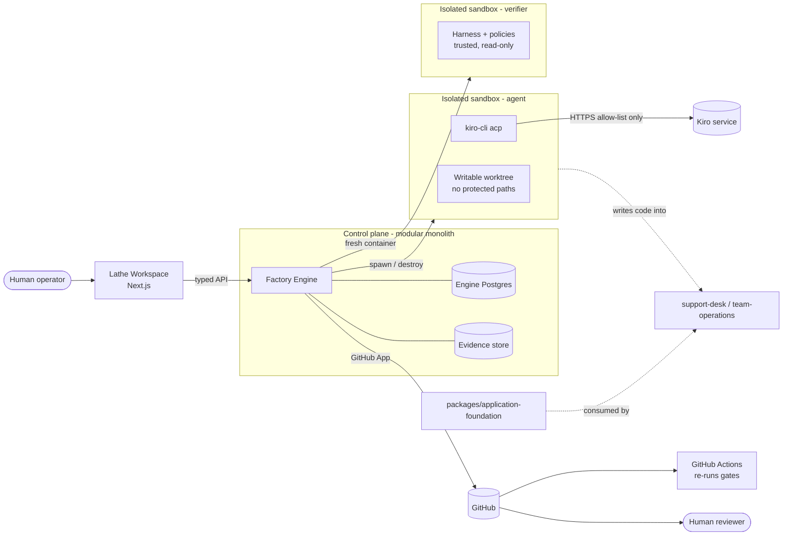

# 1. High-level system architecture (Proposed)

```mermaid
flowchart LR
  User([Human operator]) --> WS[Lathe Workspace<br/>Next.js]
  WS -->|typed API| ENG

  subgraph CP[Control plane - modular monolith]
    ENG[Factory Engine]
    DB[(Engine Postgres)]
    EV[(Evidence store)]
    ENG --- DB
    ENG --- EV
  end

  ENG -->|spawn / destroy| SBX
  subgraph SBX[Isolated sandbox - agent]
    KIRO[kiro-cli acp]
    WT[Writable worktree<br/>no protected paths]
  end
  KIRO -->|HTTPS allow-list only| KAPI[(Kiro service)]

  ENG -->|fresh container| VER
  subgraph VER[Isolated sandbox - verifier]
    H[Harness + policies<br/>trusted, read-only]
  end

  ENG -->|GitHub App| GH[(GitHub)]
  GH --> CI[GitHub Actions<br/>re-runs gates]
  GH --> Human([Human reviewer])
  FND[packages/application-foundation] -. consumed by .-> GEN[support-desk / team-operations]
  SBX -. writes code into .-> GEN
```
