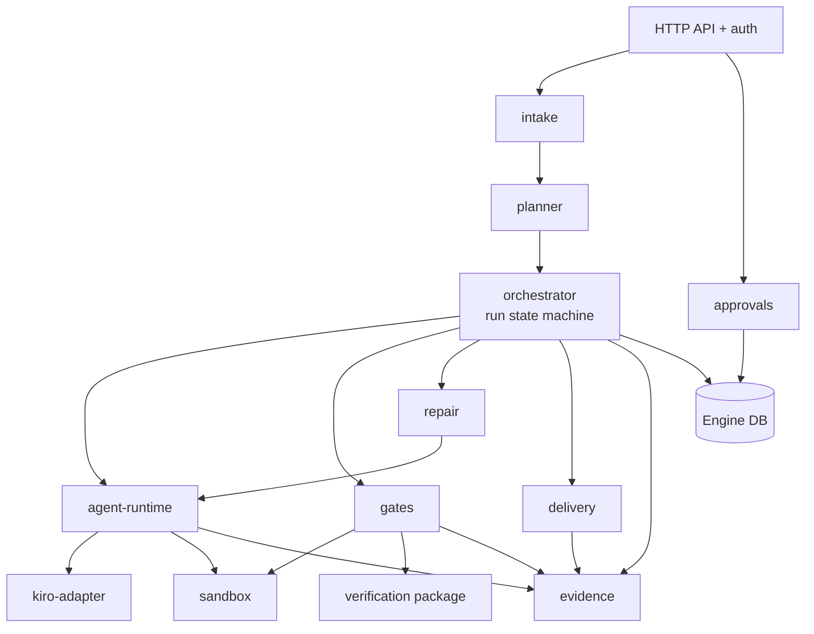
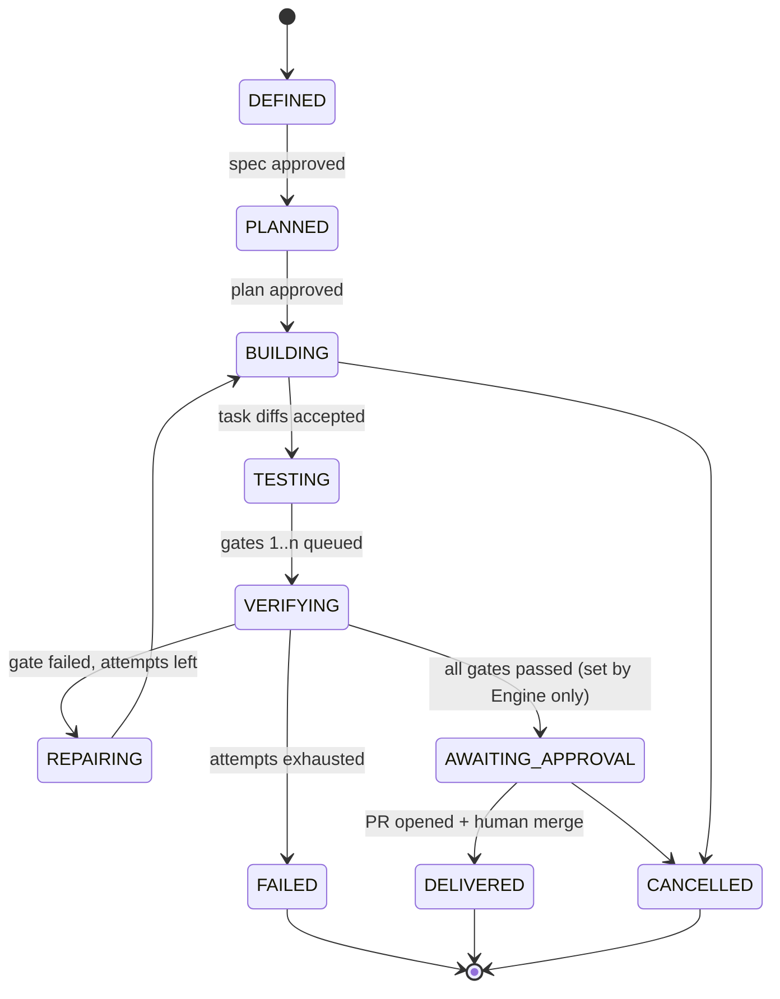

# 2. Factory Engine internals (Proposed)

```mermaid
flowchart TB
  API[HTTP API + auth] --> INT[intake]
  API --> APR[approvals]
  INT --> PLN[planner]
  PLN --> ORC[orchestrator<br/>run state machine]
  ORC --> AR[agent-runtime]
  ORC --> GT[gates]
  ORC --> RP[repair]
  ORC --> DLV[delivery]
  AR --> KA[kiro-adapter]
  AR --> SB[sandbox]
  GT --> SB
  GT --> VP[verification package]
  RP --> AR
  ORC --> EVD[evidence]
  AR --> EVD
  GT --> EVD
  DLV --> EVD
  ORC --> STORE[(Engine DB)]
  APR --> STORE
```

```mermaid
stateDiagram-v2
  [*] --> DEFINED
  DEFINED --> PLANNED: spec approved
  PLANNED --> BUILDING: plan approved
  BUILDING --> TESTING: task diffs accepted
  TESTING --> VERIFYING: gates 1..n queued
  VERIFYING --> REPAIRING: gate failed, attempts left
  REPAIRING --> BUILDING
  VERIFYING --> FAILED: attempts exhausted
  VERIFYING --> AWAITING_APPROVAL: all gates passed (set by Engine only)
  AWAITING_APPROVAL --> DELIVERED: PR opened + human merge
  AWAITING_APPROVAL --> CANCELLED
  BUILDING --> CANCELLED
  FAILED --> [*]
  DELIVERED --> [*]
  CANCELLED --> [*]
```
