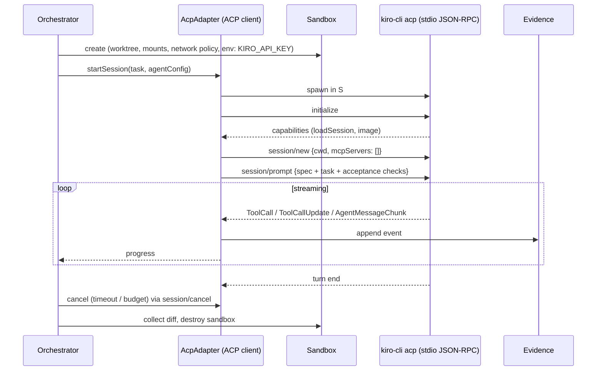

# 3. Kiro integration (Proposed; protocol facts from kiro.dev ACP docs)

```mermaid
sequenceDiagram
  participant O as Orchestrator
  participant A as AcpAdapter (ACP client)
  participant S as Sandbox
  participant K as kiro-cli acp (stdio JSON-RPC)
  participant E as Evidence

  O->>S: create (worktree, mounts, network policy, env: KIRO_API_KEY)
  O->>A: startSession(task, agentConfig)
  A->>K: spawn in S
  A->>K: initialize
  K-->>A: capabilities (loadSession, image)
  A->>K: session/new {cwd, mcpServers: []}
  A->>K: session/prompt {spec + task + acceptance checks}
  loop streaming
    K-->>A: ToolCall / ToolCallUpdate / AgentMessageChunk
    A->>E: append event
    A-->>O: progress
  end
  K-->>A: turn end
  O->>A: cancel (timeout / budget) via session/cancel
  O->>S: collect diff, destroy sandbox
```

Options matrix: see ARCHITECTURE.md §5. Fallback: `kiro-cli chat --no-interactive --trust-tools=...` with `KIRO_API_KEY`.
