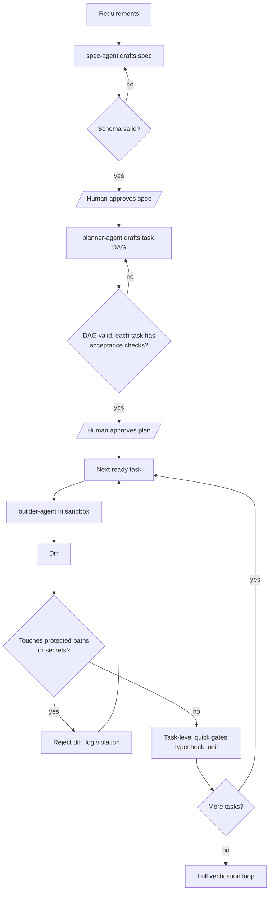

# 4. Application generation workflow (Proposed)

```mermaid
flowchart TD
  R[Requirements] --> SA[spec-agent drafts spec]
  SA --> V1{Schema valid?}
  V1 -- no --> SA
  V1 -- yes --> H1[/Human approves spec/]
  H1 --> PA[planner-agent drafts task DAG]
  PA --> V2{DAG valid, each task has<br/>acceptance checks?}
  V2 -- no --> PA
  V2 -- yes --> H2[/Human approves plan/]
  H2 --> T[Next ready task]
  T --> B[builder-agent in sandbox]
  B --> D[Diff]
  D --> P{Touches protected paths<br/>or secrets?}
  P -- yes --> REJ[Reject diff, log violation]
  P -- no --> Q[Task-level quick gates:<br/>typecheck, unit]
  Q --> M{More tasks?}
  M -- yes --> T
  M -- no --> FV[Full verification loop]
  REJ --> T
```
