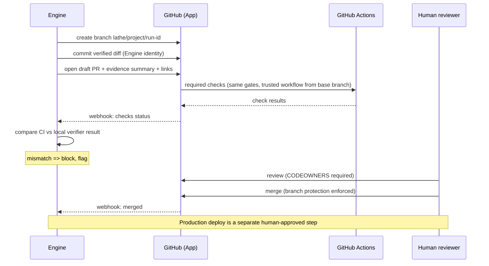

# 6. GitHub delivery workflow (Proposed)

```mermaid
sequenceDiagram
  participant E as Engine
  participant G as GitHub (App)
  participant CI as GitHub Actions
  participant H as Human reviewer

  E->>G: create branch lathe/project/run-id
  E->>G: commit verified diff (Engine identity)
  E->>G: open draft PR + evidence summary + links
  G->>CI: required checks (same gates, trusted workflow from base branch)
  CI-->>G: check results
  G-->>E: webhook: checks status
  E->>E: compare CI vs local verifier result
  Note over E: mismatch => block, flag
  H->>G: review (CODEOWNERS required)
  H->>G: merge (branch protection enforced)
  G-->>E: webhook: merged
  Note over E,H: Production deploy is a separate human-approved step
```
