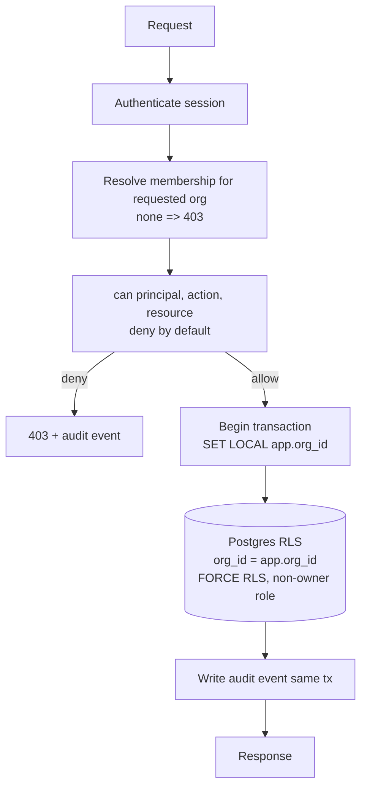
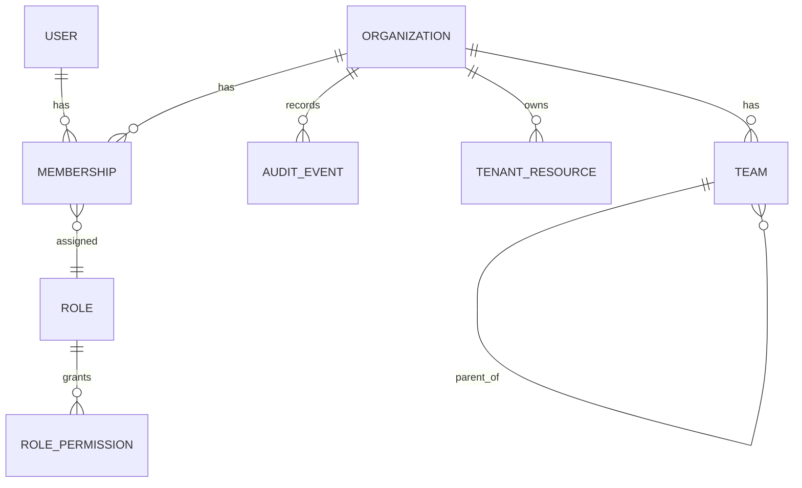

# 7. Tenant isolation and authorization model (Proposed)

```mermaid
flowchart TD
  REQ[Request] --> AUTHN[Authenticate session]
  AUTHN --> MEM[Resolve membership for requested org<br/>none => 403]
  MEM --> PERM[can principal, action, resource<br/>deny by default]
  PERM -- deny --> D403[403 + audit event]
  PERM -- allow --> TX[Begin transaction<br/>SET LOCAL app.org_id]
  TX --> RLS[(Postgres RLS<br/>org_id = app.org_id<br/>FORCE RLS, non-owner role)]
  RLS --> AUD[Write audit event same tx]
  AUD --> RES[Response]
```

```mermaid
erDiagram
  USER ||--o{ MEMBERSHIP : has
  ORGANIZATION ||--o{ MEMBERSHIP : has
  MEMBERSHIP }o--|| ROLE : assigned
  ROLE ||--o{ ROLE_PERMISSION : grants
  ORGANIZATION ||--o{ AUDIT_EVENT : records
  ORGANIZATION ||--o{ TENANT_RESOURCE : owns
  ORGANIZATION ||--o{ TEAM : has
  TEAM ||--o{ TEAM : parent_of
```

Team Operations: scope chain org → team → project. Permission resolution walks up the chain; an explicit deny at any level wins.
